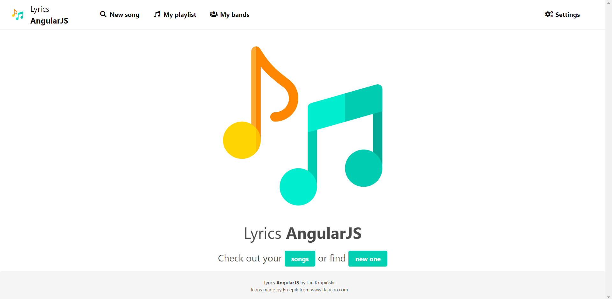

# Lyrics AngularJS
Web app with music lyrics written in AngularJS

## Installation
Download or clone repository

Add .env file with custom PORT field (default 4000)
```
PORT=...
```

Run
```bash
$ npm install
```

## Running the app
```bash
# development
$ npm start

# watch mode
$ npm run watch
```

## Homepage view
